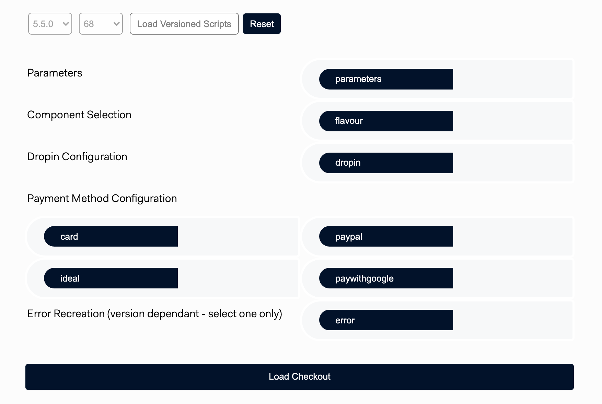
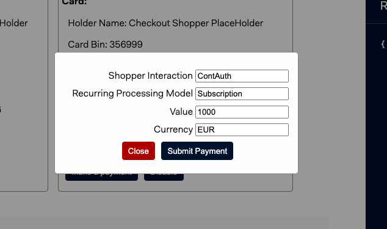

# Integrations Testing Tool

**Built on the back of **


> ⚠️ **This repository is for demo and tetsing purposes only**


### Additional files and folders
The following files and folders are new and additional files written and added:

- versionControl.js
- versionForm.js
- info.js
- checkoutForm.js
- componentConfiguration.js
- codeDemo.js
- dropin/componentParams.js
- sessions/sessionParams.js
- /recurring
- /paymentLinks

### Modified files
The following files and folders are existing files that were modified or rewritten:

- index.html
- utils.js
- dropin/dropin.js
- dropin/index.html
- sessions/dropin.js

### Playground
The playground folder is "nonfuctional", all files and folders in here are only used as a reference when initially building the tool.


## Requirements

To run this project, **create** a `.env` file on your project's root folder following the example on `.env.default`.

```
MERCHANT_ACCOUNT=MyMerchantAccount
CHECKOUT_APIKEY=MY_CHECKOUT_API_KEY
CLIENT_KEY=MY_CLIENT_KEY
```

These variables can be found in Adyen Customer Area. For more information, visit our [Get started with Adyen guide](https://docs.adyen.com/get-started-with-adyen#page-introduction).

If the forms don't seem to load, please check if you have:

1. Used the correct `clientKey`
2. Configured the `origin` on the Customer Area as an allowed origin

## Installation

### Running the PHP Server

Navigate to the root of the project and run the `start.sh` script:

```
$ cd tech-support-repository
$ ./start.sh
```

A PHP server will start on `http://localhost:3000`.

## Usage

### Dropin / Components

1. Navigate to Dropin / Components
2. Select the version you wish to test on, once selected, you will see the following form:



3. Select the parameters, configuration, component or errors you wish to recreate/mount. If no parameters are selected, it will default to predefined values.


4. Continue testing

#### Recurring
After a successful payment, you have the option to proceed to recurring.

1. In recurring you can view the stored payment methods, disable or make a recurring payment:




### Payment Links

**Currently under construction**

### Sessions Dropin

**Currently under construction**


## Documentation

For the complete integration guide, refer to the [Web Components documentation](https://docs.adyen.com/checkout/components-web/).


## License

This repository is open source and available under the MIT license. For more information, see the LICENSE file.
