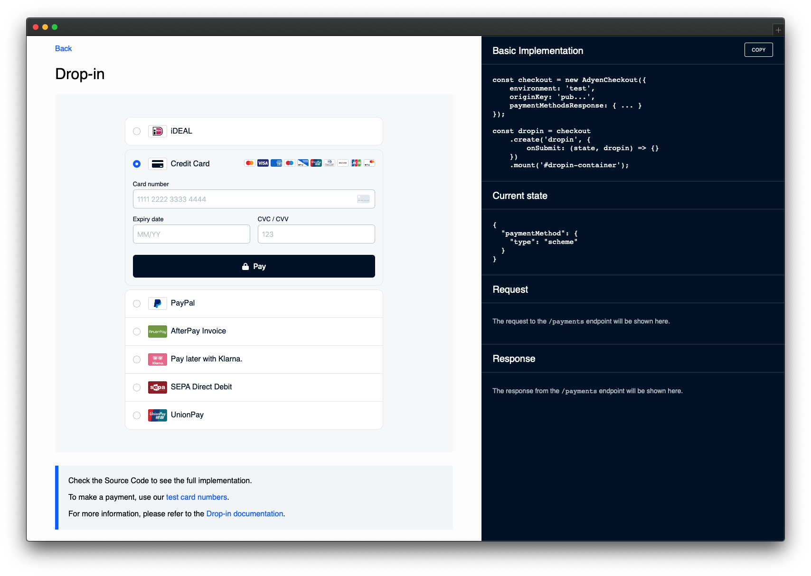

# Integrations Testing Tool

**Built on the back of Adyen Web sample code**



> ⚠️ **This repository is for demo and tetsing purposes only**

## Requirements

To run this project, **create** a `.env` file on your project's root folder following the example on `.env.default`.

```
MERCHANT_ACCOUNT=MyMerchantAccount
CHECKOUT_APIKEY=MY_CHECKOUT_API_KEY
CLIENT_KEY=MY_CLIENT_KEY
```

These variables can be found in Adyen Customer Area. For more information, visit our [Get started with Adyen guide](https://docs.adyen.com/get-started-with-adyen#page-introduction).

If the forms don't seem to load, please check if you have:

1. Used the correct `clientKey`
2. Configured the `origin` on the Customer Area as an allowed origin

## Installation

### Running the PHP Server

Navigate to the root of the project and run the `start.sh` script:

```
$ cd adyen-components-js-sample-code
$ ./start.sh
```

A PHP server will start on `http://localhost:3000`.

## Documentation

For the complete integration guide, refer to the [Web Components documentation](https://docs.adyen.com/checkout/components-web/).


## License

This repository is open source and available under the MIT license. For more information, see the LICENSE file.
